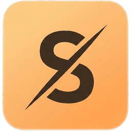
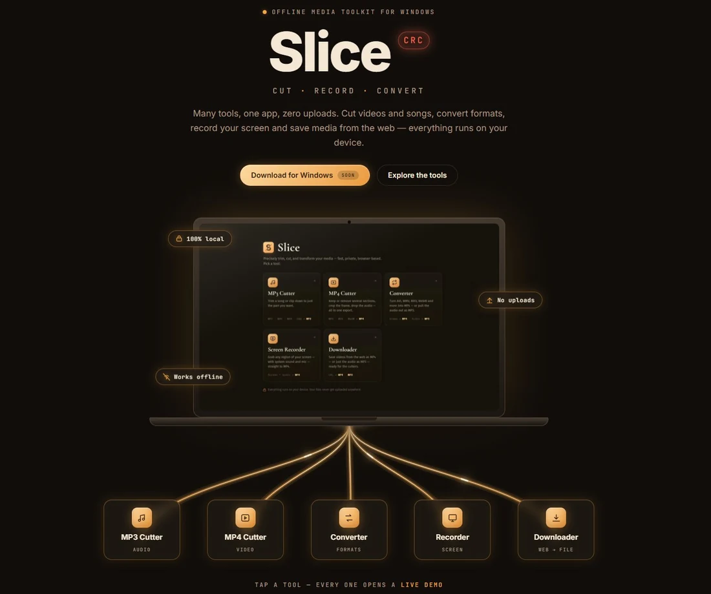
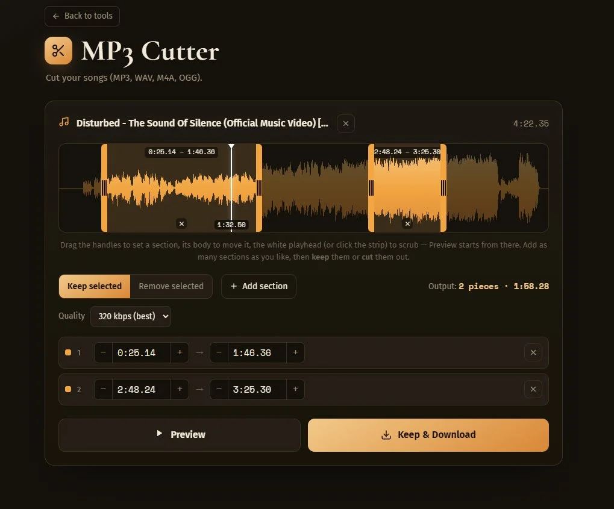
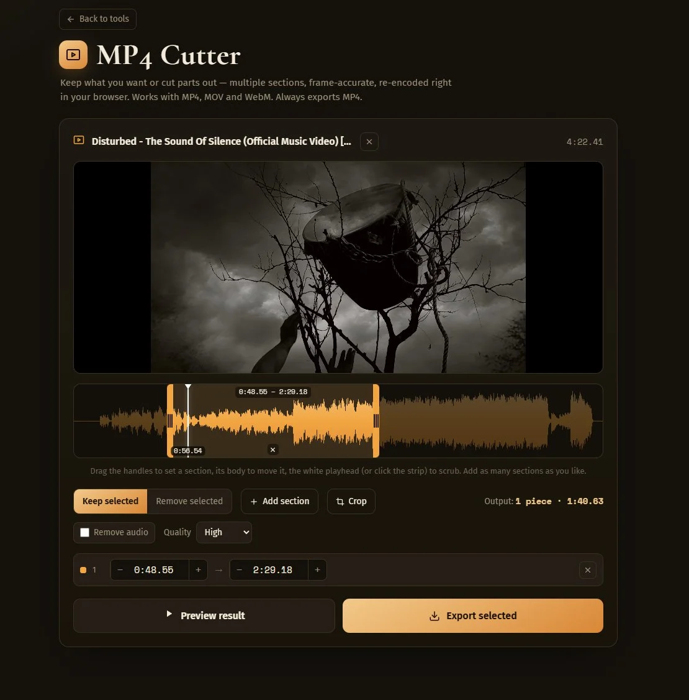
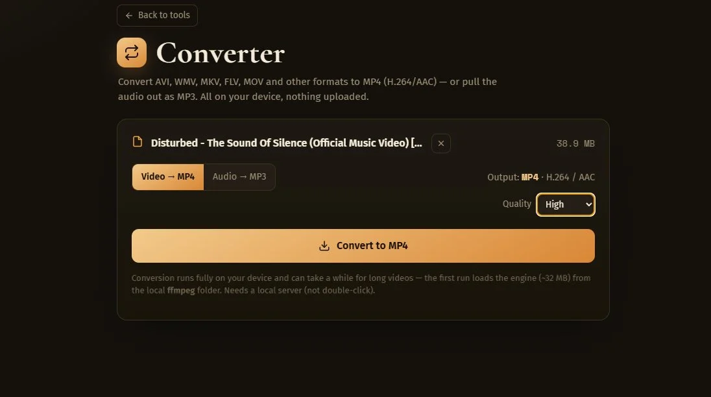
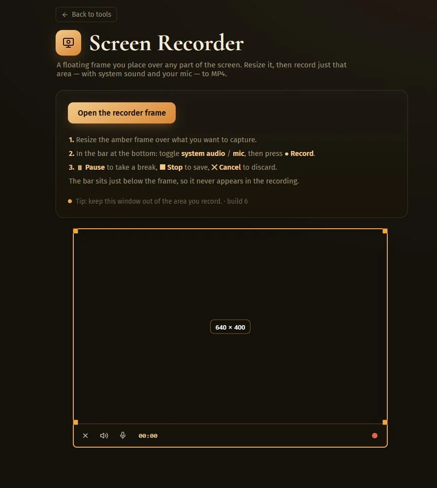
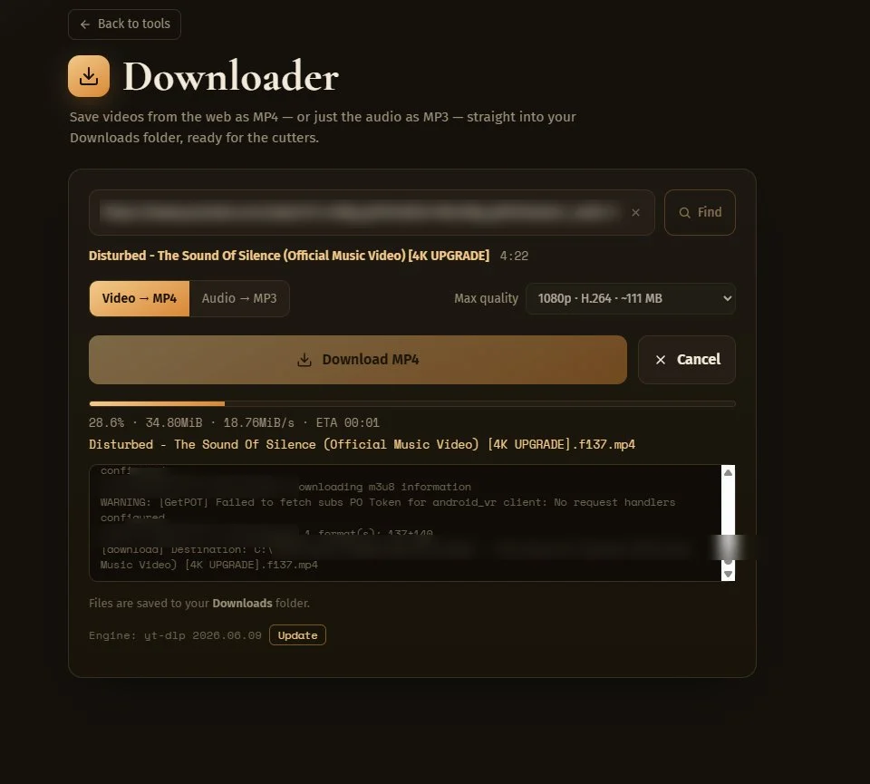

# Slice CRC

### Cut · Record · Convert — 100% on your device

**A private, offline media toolkit for Windows.**
Many tools in one app. No uploads, no account, no telemetry.

[**→ Get Slice at slice-crc.com**](https://slice-crc.com/)

 

---

## What is Slice?

Slice CRC is a Windows app that bundles five media tools into a single window. Everything runs **locally** with a built-in media engine — your files never get uploaded anywhere, and most tools work completely offline.

It's built for people who want quick, no-nonsense media editing without throwing their files at a cloud service.

---

## The five tools

### 🎵 MP3 Cutter
Cut songs on a real waveform. Mark multiple sections to keep or remove, drag the handles, scrub the playhead, and export one clean MP3 with seamless joins.

---

### 🎬 MP4 Cutter
Keep or remove several sections, crop the frame, drop the audio — all in one export. Frame-accurate, with smart bitrate detection so quality never collapses.

---

### 🔄 Converter
Turn AVI, WMV, MKV, WebM and more into MP4 — or pull the audio out as MP3 at the bitrate you choose. Drop a file, pick the output, done.

---

### 🎥 Screen Recorder
A floating frame you place over any part of the screen. Resize it, then record just that area — with system sound and your mic — straight to MP4.

---

### ⬇️ Downloader
Save videos from the web as MP4 — or just the audio as MP3 — straight into your Downloads folder, ready for the cutters.

---

## Why Slice?

- **100% local** — processing happens on your machine, nothing is uploaded
- **No account, no telemetry** — it doesn't track you or phone home
- **Works offline** — only the Downloader needs a connection
- **One window** — five tools, no plugins, no extra codecs
- **One-time purchase** — no subscription

## Requirements

- Windows 10 or Windows 11 (64-bit)
- No additional codecs or plugins needed

## Download

Slice is currently in **private beta**.

👉 **Head to [slice-crc.com](https://slice-crc.com/)** to try the live demos and request a free beta key.

## Supported formats

- **Video in:** MP4, MOV, WebM, AVI, WMV, MKV and more → always exports **MP4**
- **Audio in:** MP3, WAV, M4A, OGG → exports **MP3**
- *(AV1 video isn't supported yet.)*

## Built with

Slice is powered by trusted open-source engines — **FFmpeg** for media processing, **yt-dlp** for downloads, and **Deno** as a helper runtime. These tools keep their own licenses. Slice's own application code is proprietary.

## Feedback & issues

Found a bug or have a feature request? [Open an issue](../../issues) — feedback during the beta is very welcome.

---

## License

**Slice CRC is proprietary software.**
© 2026 Paris Dalakouras. All rights reserved.

This repository is a public showcase. The application source code is **not** publicly available and is not licensed for redistribution or reuse.

---

**[slice-crc.com](https://slice-crc.com/)** · Cut · Record · Convert

